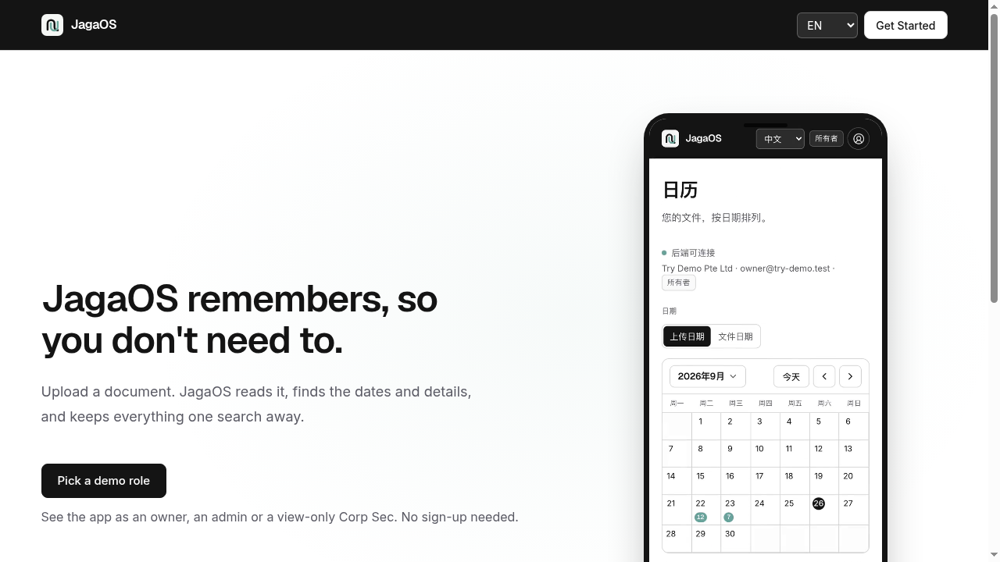
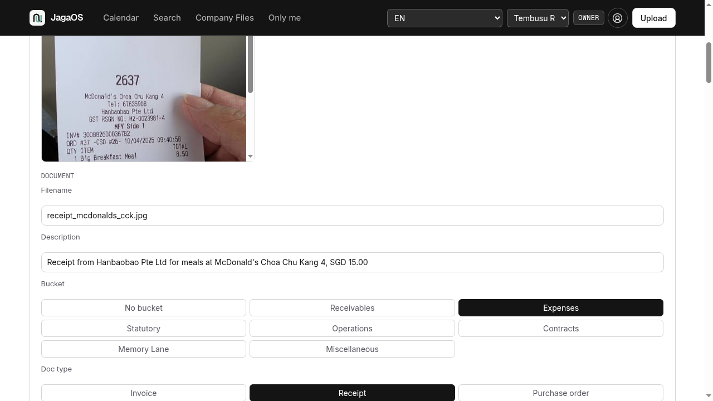
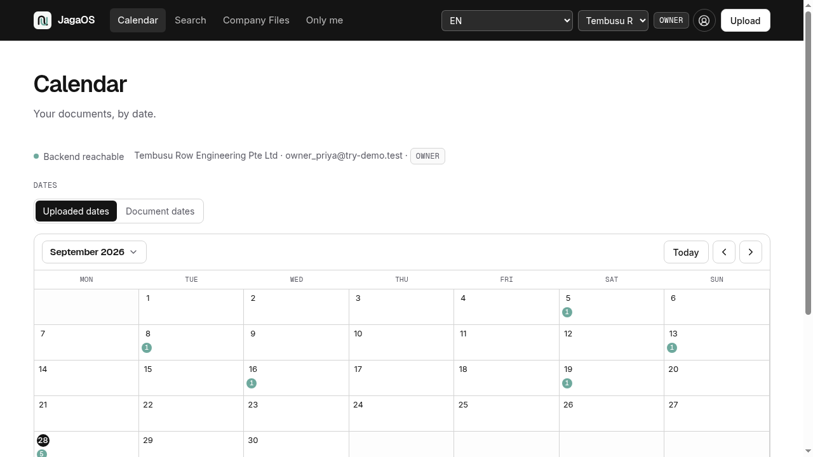
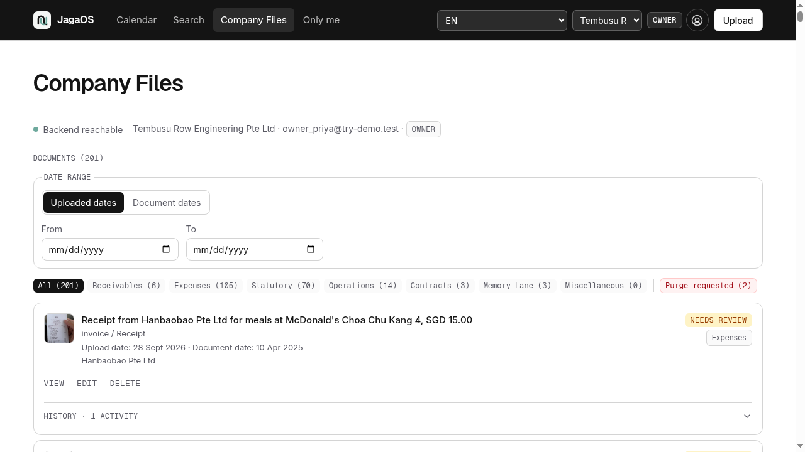
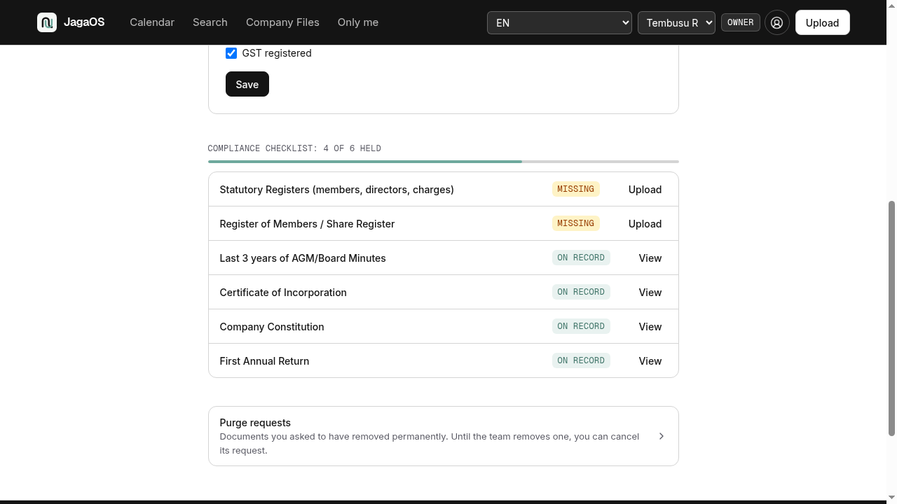

# JagaOS

Company memory for Singapore SMEs. A Show Me Your Agents 2026 hackathon project by Team AdHoc.



## Why we built it

We joined the NUS-ISS and AWS Show Me Your Agents hackathon in the SME category, and we built for a company we know well: my own SME. It's still active, just in a quiet non-trading season (dormant). And even when a company isn't trading, its records and responsibilities don't go away. The remembering still matters.

A small team keeps invoices, letters, company records and photos in many places, and that's completely normal. Later, someone needs to remember what was filed, what might be missing, and which version to trust. We wondered if an agent could help a company remember, gently, without asking its people to give up control.

That became JagaOS. It remembers, so you don't need to.

## From an idea to a prototype

I built the prototype over about six days with Claude Code Pro, using my subscription and my team member's when my weekly session ran out. I also borrowed my brother's subscription to walk back a costly mistake.

Six days, three subscriptions, and one simple moment at the heart of it all: someone finds a document, uploads it, and hopes it will be easy to find again. JagaOS reads the document, suggests what it is and what details it carries, then leaves the final check to a person. Nothing enters Company Files just because the model sounds confident. People stay in charge.

The frontend uses React, TypeScript, Vite and Tailwind CSS. A Python FastAPI backend uses LangGraph for the document flow, SQLite and local file storage for records, and the hackathon's model gateway for Claude Sonnet 4.5. Local text extraction and OCR read documents before the model receives their text. The backend runs on AWS Lightsail. The frontend is live on Vercel and on AWS.



## If you run the company

Open the Calendar to find files by date, search Company Files, or check the document checklist in Company Settings. The month view shows at a glance which days hold documents, so finding one is as easy as remembering roughly when it happened. The checklist points back to the files it relies on. It shows what the company has on hand; it does not interpret the law or promise that every obligation has been met.



You can switch between companies without mixing their records. Files in Only me stay separate from Company Files. A file's History shows what happened to it.





## If you help keep the records

Upload a document or photo. JagaOS reads what it can, suggests a place for it, and brings the details to the review queue. An owner or admin confirms or corrects the proposal before filing. A corporate secretary can view the company records without editing them.

Suspicious instructions hidden in a document are blocked for review, not followed. When model calls are unavailable or switched off, the app has a clean failure path. The company stays in charge of its memory.

## Try the demo

Vercel site: [jagaos.vercel.app](https://jagaos.vercel.app/)

3-minute demo video: [JagaOS demo video](https://youtu.be/kINgLDyfUjQ)

## Run locally

You need Python 3.12, Node.js and npm (a recent LTS version), and a terminal. Backend dependencies are in `requirements.txt`; frontend in `web/package.json`. OCR of scanned files needs a local Tesseract installation. Don't commit a populated `.env` or put a model key in `web/`.

```bash
git clone https://github.com/fresfrida/jagaos.git
cd jagaos
python3.12 -m venv .venv
.venv/bin/pip install -r requirements.txt
cp .env.example .env
```

In `.env`, keep the repo's local paths (`JAGA_DB_PATH=./data/jaga.db` and `JAGA_DOCS_PATH=./data/docs`). The template's `LLM_GATEWAY_API_KEY=` stays blank. To run without spending model credits, set `LLM_CALLS_DISABLED=1`. The app runs, but uploads needing a model answer will be refused.

Start the backend from the repo root:

```bash
.venv/bin/uvicorn app.main:app --host 127.0.0.1 --port 8000 --reload
```

In another terminal:

```bash
cd jagaos/web
npm ci
npm run dev
```

Leave `web/.env.example`'s `VITE_API_BASE_URL` commented out for local dev; the app then uses `http://127.0.0.1:8000`. Open the URL Vite prints. A local demo starts empty; `scripts/seed_dev_db.py` can add sample data, but it needs a running backend and goes through the real model pipeline.

For code checks: `.venv/bin/pytest tests/ -q` from the root; `npm run typecheck`, `npm test`, and `npm run build` from `web/`.

## A note to the organisers

Our video and materials were submitted based on the code as of 9:00am on 28 September 2026, preserved at the `hackathon-submission` tag. Commits after that are for hosting JagaOS live beyond the hackathon, including turning off uploads on the public playground, plus this README and its screenshots. Our apologies for the post-deadline activity, and thank you for having us.

## Please enjoy using the site

JagaOS is a hackathon prototype, built around a real SME and the everyday work of keeping its records together. I hope it makes finding a document, and knowing what happened to it, feel a little lighter.

[Try JagaOS](https://jagaos.vercel.app/)
